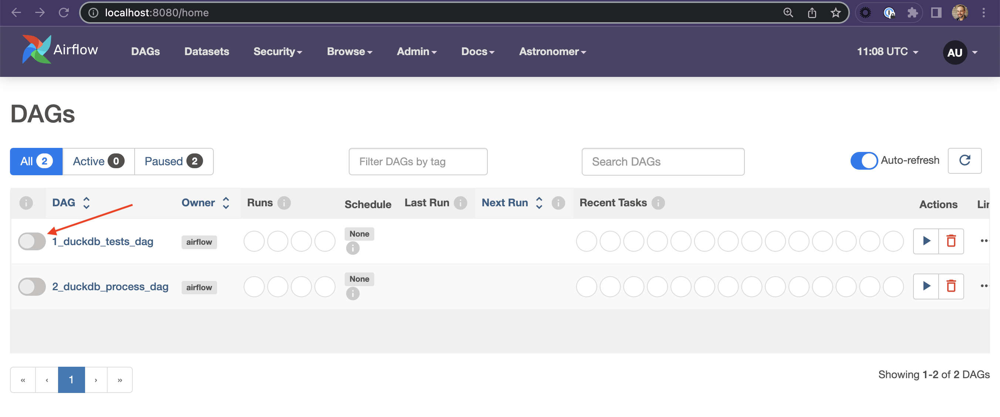
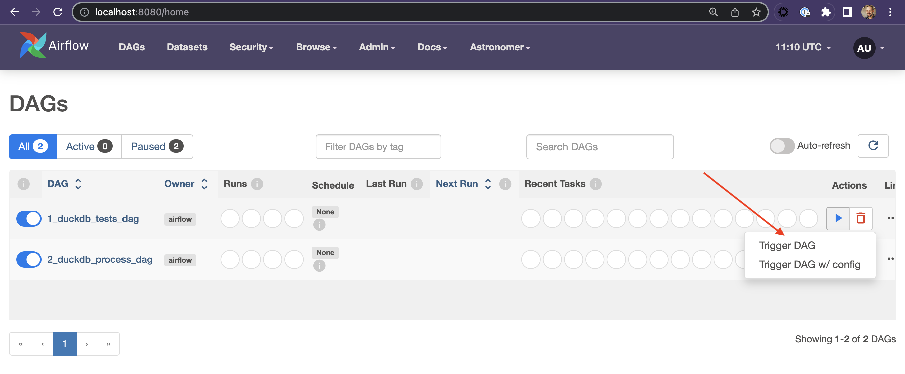
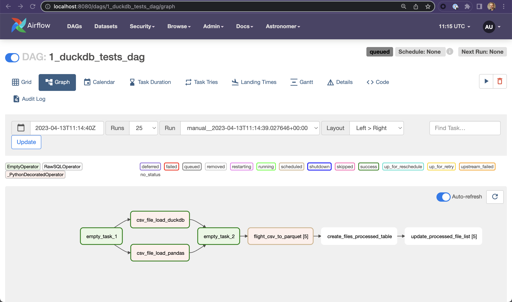

## Using DuckDB with Apache Airflow

This repo has the code that goes with [this blog post](https://medium.com/....) on **How to Best Use DuckDB with Apache Airflow**. The blog post contains the important details about the process, this README will show you how to get the project up and running.


There are some specific prerequisites you need to run this repo:
1. A Docker Engine. [Docker Desktop](https://www.docker.com) or [Colima](https://github.com/abiosoft/colima) both work with the Astro CLI.
2. The [Astro CLI](https://docs.astronomer.io/astro/cli/overview)
3. The data files need to be upload to an S3 (or S3 compliant service like Minio) that you have access to.  

The files needed are hosted on the [transtats site](https://transtats.bts.gov/PREZIP/) and the file names looks like: `On_Time_Reporting_Carrier_On_Time_Performance_1987_present_2002_1.zip`. This is the On Time Reporting data for flights in the US. The `fetch_files.sh` script included in this repo will fetch and unzip the files for 2018 - 2022. Run the script somewhere locally and take a break from doing computer things while it runs. You then need to upload the csv files to a folder on an S3 bucket somewhere.

You need to then update the `MY_S3_BUCKET` variable in both DAG files (`dags/duckdb_process_dag.py` and `dags/duckdb_test_dag.py`) with your S3 path. This is near the top of file, so it will be easy to find. Change this line:

> ```MY_S3_BUCKET = 's3://jf-ml-data/flight_data/'```

to you S3 bucket's path. Once that's done, you are good to go. 

Here are the steps to follow to get this project running:
1. ### Clone the workshop repo to your local machine.  
   `$ git clone https://github.com/fletchjeff/duckdb_demo`

2. ### Start up the local astro services.  
    `$ cd duckdb_demo`  
    `$ astro dev start`

3. ### Run the DAGs
    Once the astro cli start up process has completed, open the Airflow UI at http://localhost:8080/

    User: `admin`  
    Password: `admin`

    You should see 2 DAGs in the DAGs list, called `1_duckdb_test_dag` and `2_duckdb_process_dag`. Make them both active by clicking the slider next to the name:

    

    You first need to run the `1_duckdb_test_dag` DAG to create the parquet files used by the second DAG. Click the play button next to the `1_duckdb_test_dag` DAG's name to trigger the DAG run:

    
    
    From there you can click the DAG's name and then the Graph icon to see how it ran in the Graph view:

    
